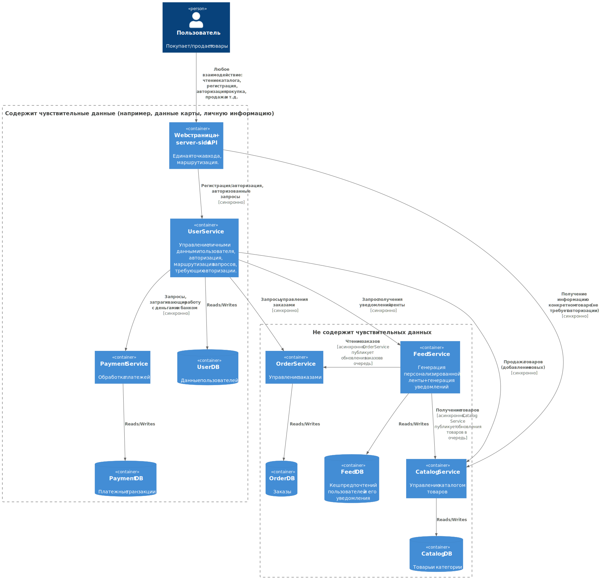

# SOA-HomeWork-1

# Диаграмма

# Инструкция запуска
docker-compose up --build из корня репозитория.

# Домены и сервисы в них

## Web + Api Domain

Зона ответственности: реализация и предоставление api для взаимодействия с маркетплейсом, сайт магазина, прокладка между user-методами и методами сервисов, инкапсуляция.

Сервис: Api Service

Api Service -- полезная прослойка, т.к. разграничивает функционал маркетплейс как единой сущности и объединений функционалов отдельных сервисов, так же при обновлении API не придётся тащить обратную совместимость во все сервисы ниже, её поддержка может быть реализована целиком в этом сервисе

## User Domain

Зона ответственности: регистрация/авторизация, профили пользователей, авторизованные запросы.

Сервис: User Service

## Catalog Domain

Зона ответственности: товары, теги и идентификаторы товаров, поиск товаров и доступ к информации о них.

Сервис: Catalog Service

## Personalization Domain

Зона ответственности: взаимодействие с не анонимным пользователем, рекомендации, построение личной ленты товаров каждого пользователя.

Сервис: Feed Service

## Notification Domain

Зона ответственности: уведомления о новых товарах и состоянии заказов, уведомления о рекомендациях

Сервис: Feed Service

## Order Domain

Зона ответственности: хранение информации о заказах, доступ к заказам, управление заказами.

Сервис: Order Service

## Payment Domain

Зона ответственности: обработка платежей, транзакции.

Сервис: Payment Service

# Логика распределения доменов

Feed Service отвечает сразу за два домена: Personalization, Notification. Такое решение было принято, так как функционал и сути доменов очень близки, оповещения это тоже в некотором смысле персонализированное взаимодействие, оно так как и генерация ленты подразумевает авторизированного пользователя и поток данных от сервера к клиенту.

Остальные сервисы распределены по доменам один к одному и вряд ли должны вызывать вопросы.

# Границы владения данными
В целом, на диаграмме и в тексте выше достаточно подробно описано всё требуемое в этом пункте.

# Альтернативные варианты декомпозиции
1. Монолит. Плюсы: легче поддерживать на начальных этапах, легче развернуть, нет задержек сети. Минусы: сложно масштабировать, сложно поддерживать и развивать на долгой дистанции, сильно меньше устойчивости к выходу из строя отдельных компонент и физических машин.

2. Объединить Feed Service, Order Service, User Service в один большой сервис, остальное оставить как есть. Плюсы: Сравнительно параллельный, относящийся к работе с пользователями будет в одном сервисе, меньше задержек из-за сети. Минусы: Очень большая функциональная нагрузка на один сервис, меньшая устойчивость к отказам, хранение части чувствительных данных вперемешку с обычными.

3. Объединить User Service и Api Service. Плюсы: маршрутизация запросов от пользователя будет в одном сервисе. Минусы: смешения логики авторизации и маршрутизации не авторизированных запросов, потеря преимуществ содержания Api Service в качестве прокладки между пользователем и внутренностями маркетплейса.

# Обоснование финального выбора
Финальный вариант: не делать как описано в альтернативных вариантах 1, 2, 3.

Представленная архитектура выбрана, т.к. имеет довольно хорошее разделение логики по сервисам, при этом не страдает огромным количеством минусов, перечисленных в альтернативных вариантах. В требованиях кейса нет ничего такого, чтобы могло сделать выбранную архитектуру непригодной.
